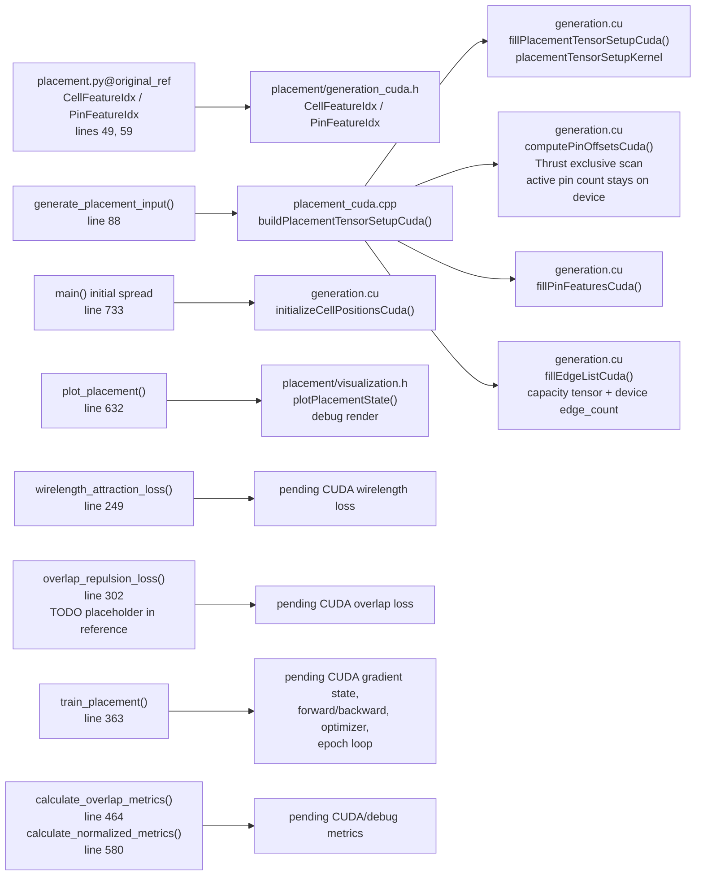

# CUDA Placement Mapping To Original Python

## Reference Anchor
- Original source: `placement.py` at commit `f7eaa0842d32f83decbbf116d93976f6411567ac`.
- Local reference branch: `original_ref`.
- CUDA path source of truth: `placement_cuda`, `placement/generation_cuda.h`, and `generation.cu`.
- Update rule: every CUDA feature added from the original Python behavior should update this table and the Mermaid diagram below in the same patch.

## Mapping Visualization

## Porting Map
| Original Python reference | CUDA/C++ mapping | Status | Notes |
| --- | --- | --- | --- |
| `CellFeatureIdx`, `PinFeatureIdx` at `placement.py:49` and `placement.py:59` | `placement/generation_cuda.h` enum classes | Done | Names are C++ style but preserve column order and tensor schema. |
| Configuration constants at `placement.py:70` through `placement.py:83` | Constants in `placement_cuda.cpp` and `generation.cu` | Partial | Macro area range, standard-cell height, pin size, and max connections are represented. CUDA default keeps `3` macros and `10` std cells per current C++ use case, while `original_ref` Python `main()` used `3` and `50`. |
| `generate_placement_input()` area and dimension setup at `placement.py:88` | `buildPlacementTensorSetupCuda()` plus `fillPlacementTensorSetupCuda()` | Done | CUDA fills `macro_areas`, `std_area_indices`, `std_cell_areas`, `areas`, widths, heights, and initial `cell_features`. RNG is cuRAND Philox, not bit-for-bit PyTorch RNG parity. |
| Macro and standard-cell pin counts in `generate_placement_input()` | `placementTensorSetupKernel` | Done | Counts are generated on device and written to both `num_pins_per_cell` and `cell_features[:, NumPins]`. |
| Python cumulative pin sizing with `num_pins_per_cell.sum().item()` | `computePinOffsetsCuda()` plus max-capacity allocation in `placement_cuda.cpp` | Done with intentional divergence | Prefix offsets are computed on device with Thrust. CUDA avoids the Python-style host scalar read by allocating a max-capacity `pin_features` tensor and treating `pin_offsets[total_cells]` as the active device-side pin count. |
| Pin feature generation loop in `generate_placement_input()` | `fillPinFeaturesCuda()` | Done | Pin positions, absolute initial positions, and fixed pin dimensions are filled on device for the active pin prefix. Rows beyond the active prefix are capacity padding. |
| Edge generation loop and `torch.unique(edge_list, dim=0)` in `generate_placement_input()` | `fillEdgeListCuda()` | Partial | Edge candidate generation is on device. CUDA avoids the Python-style exact-size/narrow step by using max-capacity `edge_list` storage plus a device `edge_count`. Duplicate filtering and different-cell preference are still not implemented. |
| Random initial placement in `main()` at `placement.py:733` | `initializeCellPositionsCuda()` | Done with intentional divergence | Python used fixed `spread_radius = 30.0`. CUDA computes a device-side total area and uses `sqrt(total_area) * kInitialSpreadScale` so generated debug layouts scale with cell sizes. |
| `plot_placement()` at `placement.py:632` | `plotPlacementState()` debug render from `placement_cuda.cpp` | Partial | CUDA path renders the CUDA-initialized placement only. Later training should render initial vs post-training CUDA placement. |
| `wirelength_attraction_loss()` at `placement.py:249` | Pending CUDA loss kernels | Not started | Needs forward loss and backward gradient accumulation against cell positions. |
| `overlap_repulsion_loss()` at `placement.py:302` | Pending CUDA loss kernels | Not started | The reference commit contains the challenge placeholder, so CUDA should implement the intended documented behavior rather than preserve the placeholder constant. |
| `train_placement()` at `placement.py:363` | Pending CUDA training loop | Not started | Needs CUDA-resident gradient state, forward/backward passes, optimizer step, gradient reset, and loss history/debug reporting. |
| `calculate_overlap_metrics()` and `calculate_normalized_metrics()` at `placement.py:464` and `placement.py:580` | Pending CUDA/debug metrics | Not started | Can begin as debug-only CPU reads, then migrate hot checks to device if they become part of training/profiling. |

## Known Divergences To Track
- CUDA uses `num_std_cells = 10` for the fixed default binary; the reference Python `main()` used `50`.
- CUDA uses cuRAND Philox and is deterministic by seed, but it is not expected to reproduce PyTorch random streams exactly.
- CUDA edge generation currently allows duplicate edges until a later de-duplication step.
- CUDA edge generation currently does not enforce the Python comment's preference for pins from different cells.
- CUDA `pin_features` and `edge_list` are capacity tensors; active ranges are tracked by `pin_offsets[total_cells]` and `edge_count` instead of exact tensor shapes.
- CUDA rendering currently emits a single generated-placement image, not the original side-by-side initial/final Python plot.
- CUDA initial spread is area-scaled instead of Python's fixed radius.
